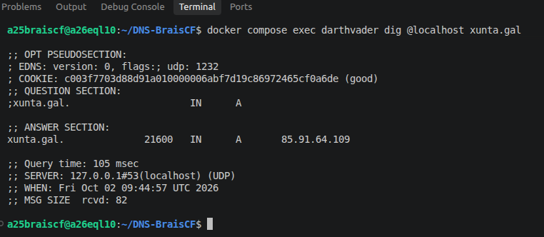

Instala o servidor BIND9 no equipo `darthvader`. Comproba que xa funciona coma servidor DNS caché pegando no documento de - entrega a saída deste comando `dig @localhost xunta.gal`.

Configura o servidor BIND9 no equipo mandalorian para que empregue como reenviador a darthvader pegando no documento de entrega contido do ficheiro /etc/bind/named.conf.options e a saída deste comando: dig @localhost santiagodecompostela.gal. Para un correcto funcionamento deberás borrar as root-hints do servidor mandalorian.

Pega no documento de entrega o contido do arquivo de zona, e do arquivo `/etc/bind/named.conf.local`

$TTL    86400
@       IN      SOA     darthvader.starwars.lan. brais.starwars.lan. (
                              2026100201 ; Serial
                                  604800 ; Refresh
                                   86400 ; Retry
                                 2419200 ; Expire
                                   86400 ) ; Negative Cache TTL

; Rexistro NS (Servidor de nomes)
@       IN      NS      darthsidious.starwars.lan.

; Rexistros de Tipo A
darthvader      IN      A       192.168.20.10
skywalker       IN      A       192.168.20.101
skywalker       IN      A       192.168.20.111
luke            IN      A       192.168.20.22
darthsidious    IN      A       192.168.20.11
yoda            IN      A       192.168.20.24
yoda            IN      A       192.168.20.25
c3p0            IN      A       192.168.20.26

; Rexistro CNAME
palpatine       IN      CNAME   darthsidious

; Rexistro MX (Servidor de correo)
@       IN      MX      10      c3p0.starwars.lan.

; Rexistro TXT
lenda   IN      TXT     "Que a forza te acompanhe"

--------------

zone "starwars.lan" {
    type master;
    file "/etc/bind/db.starwars.lan";
};
