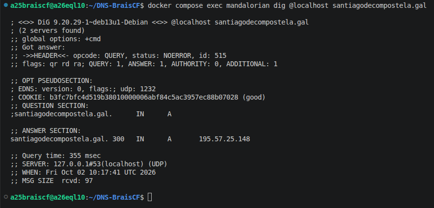
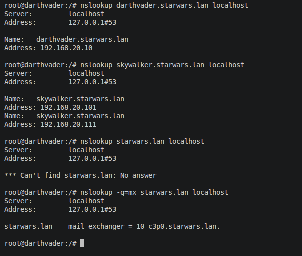
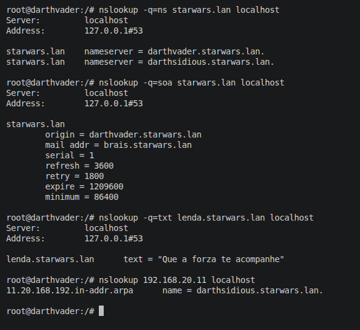

# 1.1 Instalación de zonas mestras primarias

* **Autor/a:** Brais
* **Data:** 07/10/2026
* **Repositorio GitHub:** https://github.com/braiscfsanclemente/DNS-BraisCF

---

## 1. Instalación e comprobación de servidor DNS caché (darthvader)

Instalouse o servidor BIND9 no contedor `darthvader`. A continuación comprobouse a súa capacidade como servidor DNS caché recursivo.

### Saída do comando `dig @localhost xunta.gal`


---

## 2. Configuración do servidor reenviador (mandalorian)

Configurouse `mandalorian` para reenviar as consultas DNS a `darthvader` (`192.168.20.10`). Elimináronse as `root-hints` para forzar a reenvío estrito.

### Contido do ficheiro `/etc/bind/named.conf.options`

```
options {
	directory "/var/cache/bind";
	forwarders {
		192.168.20.10;
	};
};
```

### Saída do comando `dig @localhost santiagodecompostela.gal`




---

## 3. Zona Primaria de Resolución Directa (`starwars.lan`)

Creouse e configurouse a zona primaria `starwars.lan`.

### Contido do ficheiro `/etc/bind/named.conf.local`

```
zone "starwars.lan" {
    type primary;
    file "/etc/bind/db.starwars.lan";
};
```

### Contido do ficheiro de zona (`/etc/bind/db.starwars.lan`)

```
$TTL    86400
@       IN      SOA     darthvader.starwars.lan. brais.starwars.lan. (
                                       1 ; Serial
                                    3600 ; Refresh
                                    1800 ; Retry
                                 1209600 ; Expire
                                 86400 ) ; Negative Cache TTL

; Servidores de nomes
@       IN      NS      darthvader.starwars.lan.
@       IN      NS      darthsidious.starwars.lan.

; Rexistros A
darthvader      IN      A       192.168.20.10
skywalker       IN      A       192.168.20.101
skywalker       IN      A       192.168.20.111
luke            IN      A       192.168.20.22
darthsidious    IN      A       192.168.20.11
yoda            IN      A       192.168.20.24
yoda            IN      A       192.168.20.25
c3p0            IN      A       192.168.20.26

; Rexistros CNAME, MX (correo) e TXT
palpatine       IN      CNAME   darthsidious.starwars.lan.
@       IN      MX      10      c3p0.starwars.lan.
lenda   IN      TXT     "Que a forza te acompanhe"
```

---

## 4. Zona de Resolución Inversa (`20.168.192.in-addr.arpa`)

Configurouse a zona de resolución inversa correspondente á rede `192.168.20.0/24`.

### Contido do ficheiro `/etc/bind/named.conf.local` (Engadido)

```
zone "20.168.192.in-addr.arpa" {
    type primary;
    file "/etc/bind/db.192.168.20";
};
```

### Contido do ficheiro de zona inversa (`/etc/bind/db.192.168.20`)

```
$TTL    604800
@       IN      SOA     darthvader.starwars.lan. brais.starwars.lan. (
                                       1 ; Serial
                                    3600 ; Refresh
                                    1800 ; Retry
                                 1209600 ; Expire
                                 86400 ) ; Negative Cache TTL

; Servidores de nomes
@       IN      NS      darthvader.starwars.lan.

; Rexistros PTR
10      IN      PTR     darthvader.starwars.lan.
11      IN      PTR     darthsidious.starwars.lan.
22      IN      PTR     luke.starwars.lan.
24      IN      PTR     yoda.starwars.lan.
25      IN      PTR     yoda.starwars.lan.
26      IN      PTR     c3p0.starwars.lan.
101     IN      PTR     skywalker.starwars.lan.
111     IN      PTR     skywalker.starwars.lan.
```

---

## 5. Probas e Verificacións de Resolución

A continuación móstranse as respostas obtidas co comando `nslookup` executado localmente. (Poderíanse executar desde cliente cambiando o localhost pola IP de darthvader).



